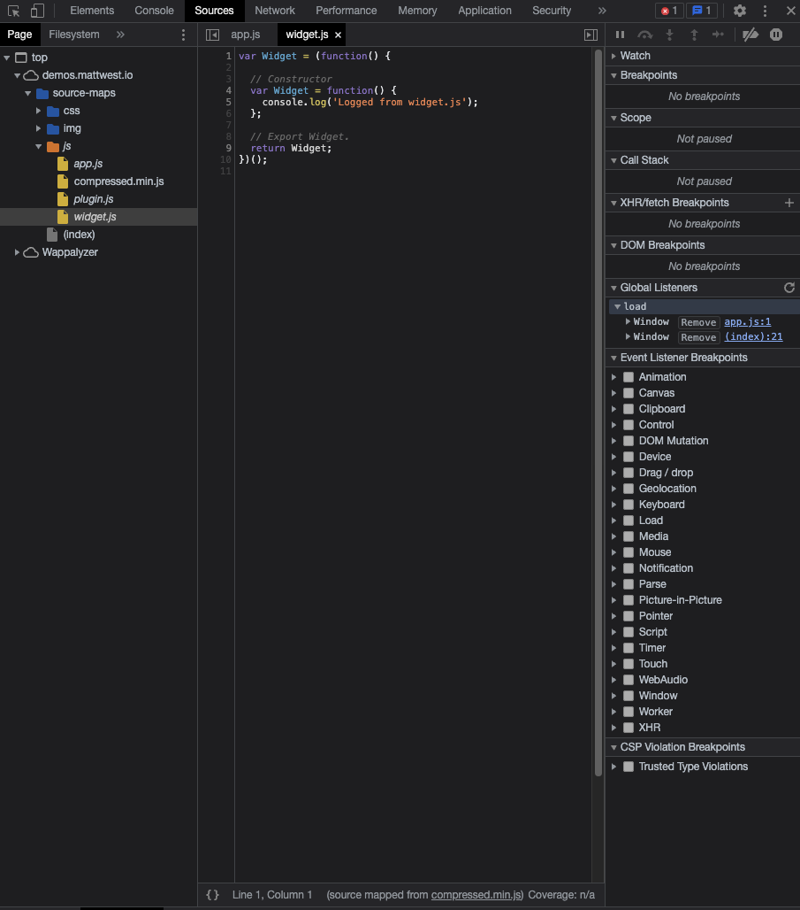

# source map

[original post](https://blog.teamtreehouse.com/introduction-source-maps)

> NOTE 의역 많이 포함.

가장 쉬운 최적화 방법 중 하나는 combine과 압축이다. (JS, CSS).  
그러나 압축된 이 파일들을 어떻게 디버깅해야 하는가? 악몽이 될 것 이다.  
두려워말라, 여기에 정답이 있다. 그리고 이것을 `source map`이라고 명명하겠다.  

`source map`은 압축된 파일을 다시 원래 소스 파일의 위치로 돌려준다.  
이것은 어플리케이션의 애셋들이 최적화되었는지 디버깅할 수 있는 쉬운 방법을 마련해준다.  
**Chrome**, **Firefox** 개발자 도구는 `source map`을 지원한다.  

이 글을 통해 우리는 `source map`이 어떻게 동작하고 생성되는지 알아본다.  
우리는 `JS source map`에 주로 다루겠지만, `CSS source map`도 같은 원리이다.  

---

## `source map`이 동작하는 방법

이름에서부터 알 수 있지만, `source map`은 모든 코드의 정보를 압축한 것을 압축하기 전의 `source`로 되돌린 `map`이다.  
압축된 파일에 따라 `source map`이 다르다는 것을 알 수 있게 될 것 이다.  

브라우저에게 `source map`이 최적화된 파일 아래에 주석으로 표시되도록 할 수 있다.  

```js
//# sourceMappingURL=/path/to/script.js.map
```

이 주석은 보통 프로그램에 의해 `source map`이 생성되면 추가된다.  
개발자 도구는 이 주석을 통해 `source map`이 사용가능한 경우 주석 경로의 파일을 불러와 개발자 도구에 표시해준다.  

또한 `X-SourceMap` HTTP header를 보내 압축된 `JS` 파일 위치를 응답할 수도 있다.

```json
X-SourceMap: /path/to/script.js.map
```

`source map` 파일은 `JSON`으로 정보를 포함한다. 아래는 그 예시.  

```json
{
    version: 3,
    file: "script.js.map",
    sources: [
        "app.js",
        "content.js",
        "widget.js"
    ],
    sourceRoot: "/",
    names: ["slideUp", "slideDown", "save"],
    mappings: "AAA0B,kBAAhBA,QAAOC,OAAOC,OAAO..."
}
```

> [Source Map Revision 3 Proposal](https://docs.google.com/document/d/1U1RGAehQwRypUTovF1KRlpiOFze0b-_2gc6fAH0KY0k/edit)에 따르면 위의 내용은 잘못된 것 같다.
> `file: "script.js.map` -> `file: "script.js"`
>
> 내 생각엔 글이 2013년도에 작성되어서, 이후에 *revision proposal* 내용이 바뀐 것 같다.

각 속성에 대해 알아보자.  

- `version`
  - [`source map spec`](https://docs.google.com/document/d/1U1RGAehQwRypUTovF1KRlpiOFze0b-_2gc6fAH0KY0k/edit)에 따라 몇버전인지.
- `file`
  - `source map` 파일 이름
- `sources`
  - 원본 `source` 파일에 대한 URL들의 어레이
- `sourceRoot`
  - *optional*
  - URL. `source`에 있는 모든 파일들의 경로
- `names`
  - `source` 파일에 있는 변수, 함수 이름을 포함한 어레이.
- `mappings`
  - [Base64 VLQs](https://blog.teamtreehouse.com/introduction-source-maps#:~:text=A%20string%20of-,Base64%20VLQs,-containing%20the%20actual) 문자열. 실제 코드 매핑된.
  - *This is where the magic happens*

## `UglifyJS`를 이용한 `source map` 생성

[UglifyJS](https://github.com/mishoo/UglifyJS)는 `JS` 파일들을 결합하고 압축하는 기능을 제공하는 유명한 cli이다.  
버전2는 아래의 플래그를 통해 기능을 제공한다. (2021 기준 버전은 3)  

- `--source-map` - The output file for the source map.
- `--source-map-root` - (optional) This populates the sourceRoot property in the map file.
- `--source-map-url` – (optional) The path to the source map on your server. This will be used in the comment that is placed in the optimized file. //# sourceMappingURL=/path/to/script.js.map
- `--in-source-map` – (optional) An input source map. This can be useful if you are compressing JavaScript files that have already been generated from source files elsewhere. Think JavaScript libraries.
- `--prefix` or `-p` – (optional) Removes n number of directories from the file paths that appear in the sources property. For example, -p 3 would drop the first three directories from the file path, so one/two/three/file.js would become file.js. Using -p relative will make UglifyJS figure out the relative paths between the source map and the original files for you.

아래는 예시 커맨드이다.  

```shell
uglifyjs [input files] -o script.min.js --source-map script.js.map --source-map-root http://example.com/js -c -m
```

그 외에 `source map`을 생성하는 여러 유틸리티들이 있다.

- [Closure](https://blog.teamtreehouse.com/introduction-source-maps#:~:text=are%20listed%20below.-,Closure,-CoffeeScript%20Compiler)
- [CoffeeScript Compiler](https://blog.teamtreehouse.com/introduction-source-maps#:~:text=CoffeeScript%20Compiler)
- [GruntJS Task for JSMin](https://blog.teamtreehouse.com/introduction-source-maps#:~:text=GruntJS%20Task%20for%20JSMin)

## Chrome 개발자 도구에서 `source map`

[`source map` demo](https://demos.mattwest.io/source-maps/)



크롬 개발자도구에서 `source map` 스크린샷을 찍었다. 그런데 html 소스에서 `source map`과 관련된 주석을 발견하지 못했다.  

## 마지막으로

`source map`을 사용하는 것은 개발자에게 웹사이트를 최적화하는 동안 같은 시간으로 straight-forward 디버깅 환경을 제공해준다.  

이 포스트에서 당신은 어떻게 `source map`이 동작하고 **UglifyJS**를 통해 생성하는지 배웠다.  
만약 당신이 웹사이트를 압축된 애셋과 함께 배포한다면, `source map` 생성을 당신의 워크플로우에 포함하는 것은 매우 의미있는 일이다.
